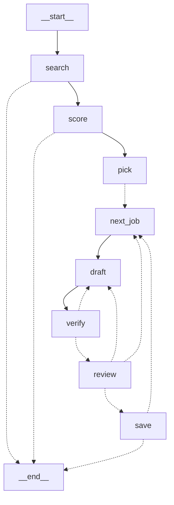

# job-agent

A human-in-the-loop job application agent built on **LangGraph**. It searches public remote-job APIs, decides which postings are worth a cover letter, drafts the letters, fact-checks them against your profile, and only saves what you approve.

```
python -m job_agent.main --fake                       # offline demo, no API key
python -m job_agent.main --search-term python --location Europe   # real run, needs GOOGLE_API_KEY
python -m evals.run_evals                             # verifier eval
uvicorn job_agent.api:app                             # HTTP demo, open http://127.0.0.1:8000/docs
python -m pytest
```

## Example run

A real run against live postings and real Gemini (`gemini-3.1-flash-lite`), unedited:

```
$ python -m job_agent.main --search-term data --location Europe

Searching for 'data' in 'Europe'...

The agent recommends writing letters for:
  [0] 8/10  Software Engineer - Data @ Dune (Europe, USA)
        This is a rare 'Level: Any' role in a data-focused company that matches your technical stack well.
        https://jobicy.com/jobs/149499-software-engineer-data
Write letters for which? (e.g. 0,2 / all / none): 0

=== Software Engineer - Data @ Dune (draft round 1) ===
[... full letter ...]

[a]pprove / [r]eject with feedback / [s]kip: r
Feedback for the redraft: mention that I am eager to learn on the job

=== Software Engineer - Data @ Dune (draft round 1) ===
[... redrafted letter, now mentions being eager to learn ...]

[a]pprove / [r]eject with feedback / [s]kip: a
Saved: applications\Dune-Software-Engineer---Data-20260923.txt

node       calls  tokens in  tokens out  llm secs
score          1       1725         488      4.06
draft          2       1352         890     14.73
verify         2       1862         952     10.54
```

Full versions: [examples/sample_run.txt](examples/sample_run.txt) (terminal output), [examples/sample_cover_letter.txt](examples/sample_cover_letter.txt) (the approved letter), [examples/sample_transcript.md](examples/sample_transcript.md) (the whole agent/human exchange, rendered from graph state).

Live job boards are unpredictable -- the same search can come back empty an hour later if nothing matching is currently posted. That's the agent working correctly (it declined to recommend senior-only postings here too), not a bug; `--fake` gives repeatable output if you want to try the mechanics without depending on what's live right now.

## The graph



| Node | What it does |
|---|---|
| `search` | Remotive, Jobicy, Arbeitnow and RemoteOK public APIs, filtered by term and location. Exact location matches are listed first, followed by Europe/EMEA/Worldwide roles. |
| `score` | One batched LLM call: fit score and a recommend/skip decision per posting. |
| `pick` | **Interrupt.** The agent asks: "write letters for these?" |
| `draft` / `verify` | Drafts a letter, then fact-checks it against `profile.txt` (LLM) and checks length (code). Failures loop back to `draft` with notes, at most twice. |
| `review` | **Interrupt.** Approve, reject with feedback (redraft), or skip. |
| `save` | Writes the approved letter to `applications/`. |

## Why LangGraph (and where it isn't used)

- **Human-in-the-loop with a checkpointer.** `interrupt()` pauses the run at the pick and review steps and resumes with the human's answer, with state preserved. The hand-rolled alternative is a state machine plus serialisation.
- **Cycles.** Verify -> redraft, and human reject -> redraft, are real loops with a bounded retry count.
- **Conditional routing.** Verdicts, empty results and an empty queue each decide the next node.
- **Not used for:** fetching and filtering jobs. That is deterministic, so it is plain functions in [job_agent/search.py](job_agent/search.py). There is no fan-out either: the free Gemini tier is rate-limited, so scoring is one batched call rather than N parallel ones.
- The checkpointer is in-memory. That is enough because the CLI pauses and resumes within one process; swapping in SQLite would make runs resumable across restarts.

## HTTP API (FastAPI)

The same graph is served over HTTP, one LangGraph thread per run. The two interrupts become request/response steps:

```
POST /runs                    {"search_term": "python", "location": "Europe"}  -> shortlist (status "waiting", pending.type "pick")
POST /runs/{id}/resume        {"chosen": [0]}                                   -> a letter to review (pending.type "review")
POST /runs/{id}/resume        {"action": "reject", "feedback": "warmer"}        -> a redrafted letter
POST /runs/{id}/resume        {"action": "approve"}                             -> status "done", letter saved
GET  /runs/{id}/transcript    ?format=markdown                                  -> the whole conversation
```

Open `/docs` for an interactive page. Use `LLM_PROVIDER=fake uvicorn job_agent.api:app` to try it offline. Runs live in the in-memory checkpointer, so they are lost on restart and it needs a single server process. Run it locally only, since every request can spend your Gemini quota.

## Transcript

Each run records the agent/human conversation as events in graph state: the shortlist and its reasons, your picks, every draft, the verifier's verdicts, and your reject/approve decisions with feedback. The CLI writes it to `applications/transcript-<time>.md`, and the API serves it at `/runs/{id}/transcript`.

## LLM layer and observability

[job_agent/llm.py](job_agent/llm.py) has a provider-agnostic model **fallback chain**. Free-tier quotas are per model, so on a 429 the call moves to the next model and the exhausted one cools down for 60s; a 404 removes a model for the session. Set `GEMINI_MODELS` to change the chain, and use `--list-models` to see what your key can use. `--fake` swaps in a deterministic offline provider that also plants a fabricated claim in the first draft, so the verify loop is exercised without a key.

Every LLM call records node, model, input/output tokens, latency and fallback hops. A summary is printed at the end of each run:

```
node       calls  tokens in  tokens out  llm secs
score          1        281          22      0.00
draft          3       1830        1314      0.00
verify         3       2176          25      0.00
```

## Eval

`evals/cases.json` holds 6 letters for one job: 3 clean, 3 with a planted fabrication (invented degree, altered metric, invented employer). `python -m evals.run_evals` reports fabrications caught and false alarms. Six cases is a smoke test, not statistics. With `--fake` it only checks the harness.

## Setup

```
pip install -r requirements.txt
cp .env.example .env    # add GOOGLE_API_KEY
```
Edit `profile.txt` and `contact.txt` with your own details. 
